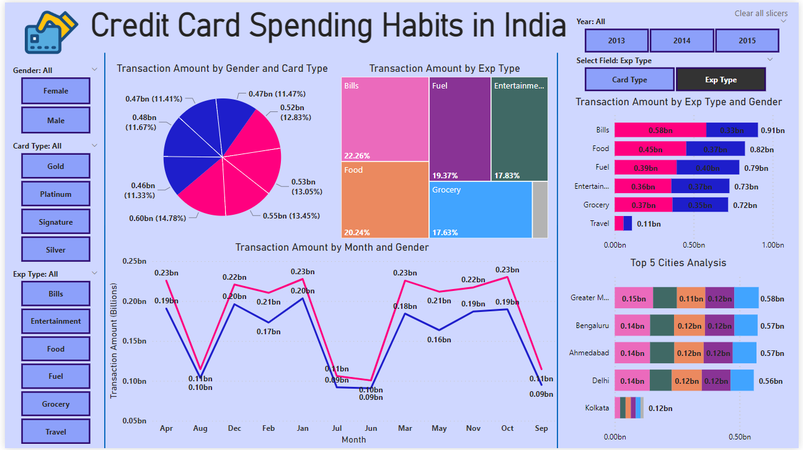

# Credit-Card-Spending-Analysis-PowerBi
The Source for this data was used from this link: https://www.kaggle.com/datasets/thedevastator/analyzing-credit-card-spending-habits-in-india

BI Report link: https://app.powerbi.com/view?r=eyJrIjoiNWU1OTEzOWEtY2Y5OS00NjY4LTliYjgtYmEzN2ExNWY3NjI0IiwidCI6IjJlYWZhNDQ4LTQzNzMtNGEyNi05NWM2LTUyZGVhNTFlODA5YSJ9

## Introduction
In the fast-paced realm of finance, where innovation drives the evolution of banking services, the necessity for keen insights into consumer behavior has never been more apparent. As legacy financial institutions navigate the intricacies of introducing new products, such as credit cards, understanding the nuanced patterns of credit card usage becomes paramount. This brings us to the heart of our latest venture — the Credit Card Usage Analysis project. Beyond the realms of conventional banking, this analysis transcends routine data scrutiny, offering a profound exploration into the habits and preferences that underpin financial decisions. In an era where tailored financial solutions reign supreme, this project emerges not just as a statistical exercise but as a strategic imperative, a compass guiding the formulation of credit offerings that resonate with the diverse needs of our clientele. Join us as we unravel the significance and implications of this insightful journey into the dynamics of credit card utilization.

